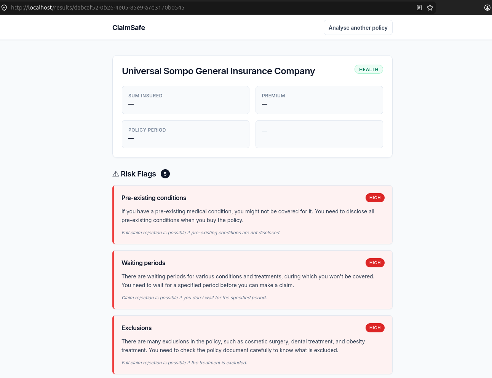
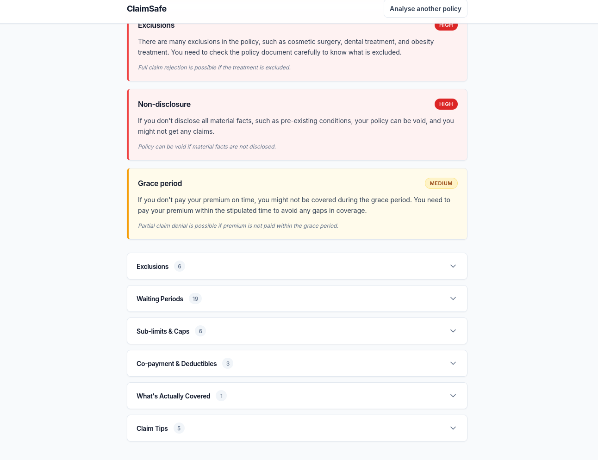

# ClaimSafe

A plain-language breakdown tool for Indian insurance policy PDFs — surfaces exclusions, waiting periods, sub-limits, and co-payment clauses that commonly cause claim rejections.

**Stack:** Node.js · TypeScript · Fastify · Python · FastAPI · pdfplumber · React · PostgreSQL · Redis · BullMQ · Docker

## Why This Project Exists

Built during a Razorpay "Fix My Itch" problem-space exploration exercise, on a free weekend. The real problem: Indian insurance policies are 40-80 page legal documents where critical information (exclusions, waiting periods, sub-limits) is buried and only discovered at claim time. This was chosen over other candidate ideas (such as Subscription Pause Middleware and SaaS Spend Optimizer) because it had the fastest path to a working build with the strongest architectural signal.

## A Note on Deployment

This project is intentionally not deployed to the public internet. 

The full system — a three-pass LLM pipeline, asynchronous job processing, in-memory PDF handling, and a multi-service architecture — is complete and runs end-to-end locally via Docker Compose. 

The decision not to deploy was made deliberately: this is a portfolio and architecture demonstration project, not a production service intended for real users. Keeping it local avoids taking on ongoing infrastructure costs, API key exposure risks, and the maintenance burden for a project with no real user base. Anyone reviewing this repository can run it locally in minutes (see the Quick Start section) to see the full pipeline working seamlessly. The deployment path was fully planned and de-risked (Fly.io configurations `fly.toml` for all three apps are included in the repository), proving that deployment wasn't skipped because it was difficult, but skipped because it wasn't necessary.

## What It Does

ClaimSafe processes complex policy PDFs and generates a clear, structured breakdown:
* Policy Summary Card
* Risk Flags (top 3-5 conditions most likely to cause claim rejection)
* Full Exclusions List
* Waiting Periods
* Sub-limits & Caps
* Co-payment & Deductibles
* What's Actually Covered
* Claim Tips

## Screenshots

### Results Overview




### Architecture Diagram


## Architecture Overview

ClaimSafe utilizes a three-pass LLM pipeline (chunking/classify → structured extraction → risk interpretation) powered by asynchronous processing via BullMQ. The system follows a multi-service pattern: a Node.js Fastify API manages the state machine, while a Python microservice handles heavy-duty PDF text and table extraction. 

For an in-depth look at the architecture decisions, please refer to the full [Architecture Decision Record (ADR)](./docs/ARCHITECTURE.md).

*(See the [Architecture Diagram](./docs/screenshots/architecture%20Diagram.png) above for the system flow).*

## Key Architecture Decisions & Trade-offs

| Decision | Reasoning | Trade-off Accepted |
| :--- | :--- | :--- |
| **Three-pass LLM pipeline (chunking → structured extraction → risk analysis)** | Separating extraction from interpretation prevents the model from blending mechanical extraction with judgment, improving accuracy on both. | More LLM calls per document, higher latency per analysis. |
| **Section-aware chunking with overlapping-window fallback** | Indian insurance PDFs vary wildly in structure; section detection preserves context, overlap prevents clause loss at chunk boundaries. | Adds deduplication complexity in the pipeline. |
| **Groq (LLaMA 3.3 70B) + Gemini 1.5 Flash instead of paid models** | Zero-cost constraint for a self-funded portfolio project. | Lower ceiling on reasoning quality vs. Claude/GPT-4 class models; mitigated by the `LLMProvider` abstraction allowing a future swap with no pipeline changes. |
| **In-memory PDF processing, zero persistence** | Strongest possible privacy story; avoids building/maintaining a storage and retention layer for a project with no real users. | No ability to re-run analysis without re-uploading; no audit trail of the original document. |
| **BullMQ + Redis for async processing** | A 60-second analysis time is incompatible with a synchronous HTTP request; production-grade pattern already proven by Gowtham in prior work. | Adds operational complexity (queue, worker, job state) vs. a simpler synchronous endpoint. |
| **Pipeline state machine persisted in PostgreSQL, not just Redis** | Enables retrying a failed pipeline from its last successful stage instead of from scratch. | Extra schema and write overhead per job. |
| **Python microservice for PDF extraction instead of a Node PDF library** | `pdfplumber` meaningfully outperforms Node alternatives on table extraction, which matters for sub-limit and waiting-period tables. | Introduces a second language/runtime into an otherwise all-TypeScript stack. |
| **Not deployed to production** | Project is an architecture and engineering demonstration, not a live product with real users. | No live demo link; mitigated by complete local run instructions and this documentation. |

## Tech Stack

| Domain | Technology | Purpose |
| :--- | :--- | :--- |
| **Backend API** | Node.js + Fastify (TypeScript) | Core orchestration, job queuing, state machine |
| **PDF Extraction** | Python + FastAPI + pdfplumber | Dedicated service for parsing PDFs and tables |
| **LLM Providers** | Groq (LLaMA 3.3 70B) & Google Gemini (1.5 Flash) | AI pipeline processing |
| **Queue / Workers** | BullMQ + Redis | Asynchronous job execution |
| **Database** | PostgreSQL | Persisting pipeline state and extracted results |
| **Frontend** | React + Vite + TailwindCSS | User interface |
| **Storage** | None (In-Memory Only) | Strict privacy guarantee |
| **Containerization**| Docker & Docker Compose | Multi-container local orchestration |
| **Logging** | Pino | Structured JSON logging |

## System Flow

1. **Upload**: User submits a PDF via the React frontend.
2. **In-Memory Extraction**: The Fastify API synchronously forwards the memory buffer to the Python PDF microservice, which extracts text and tables, then returns chunked data. The PDF buffer is immediately discarded.
3. **Queueing**: The API creates a job in PostgreSQL and queues it via BullMQ, returning a `job_id` to the frontend.
4. **Processing (Pass 0-2)**: The BullMQ worker processes the job asynchronously through the three-pass LLM pipeline using Groq and Gemini.
5. **Results**: The frontend polls for completion and displays the structured breakdown and risk flags.

## Quick Start (Run It Locally)

**Prerequisites:**
* Docker and Docker Compose installed
* API Keys for Groq and Google Gemini

**Setup:**
1. Clone the repository and navigate to the root directory.
2. Copy the environment template:
   ```bash
   cp api/.env.example api/.env
   ```
3. Add your `GROQ_API_KEY` and `GEMINI_API_KEY` to `api/.env`.
4. Start the full stack:
   ```bash
   docker compose up -d --build
   ```
5. Open your browser to `http://localhost`.

## Project Structure

```text
.
├── api/                  # Node.js + Fastify backend (TypeScript)
│   ├── src/
│   │   ├── db/           # PostgreSQL schema and migrations
│   │   ├── llm/          # Groq and Gemini provider abstractions
│   │   ├── pipeline/     # Three-pass LLM state machine
│   │   ├── queue/        # BullMQ worker and producer
│   │   └── routes/       # HTTP endpoints
├── pdf-service/          # Python + FastAPI microservice
│   ├── core/             # Section-aware chunking logic
│   └── routers/          # PDF extraction endpoints
├── frontend/             # React + Vite UI
│   └── src/
│       ├── api/          # Polling and submission hooks
│       └── components/   # Result rendering cards
├── docker-compose.yml    # Local orchestration
└── nginx/                # Reverse proxy for frontend and API
```

## What This Project Demonstrates

ClaimSafe serves as a concrete example of designing an AI-native application with a focus on robust data engineering. It highlights the use of an asynchronous job architecture, a multi-service ownership model separating compute-heavy text parsing from API orchestration, and production-thinking principles like structured logging, state machines, and retryability. Every architectural decision in this system — including the decision not to deploy it — was made deliberately and is documented above.
